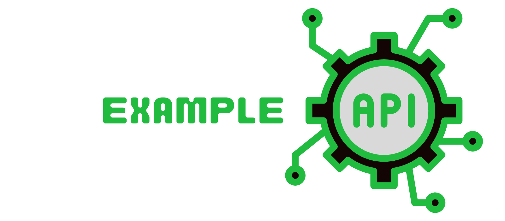
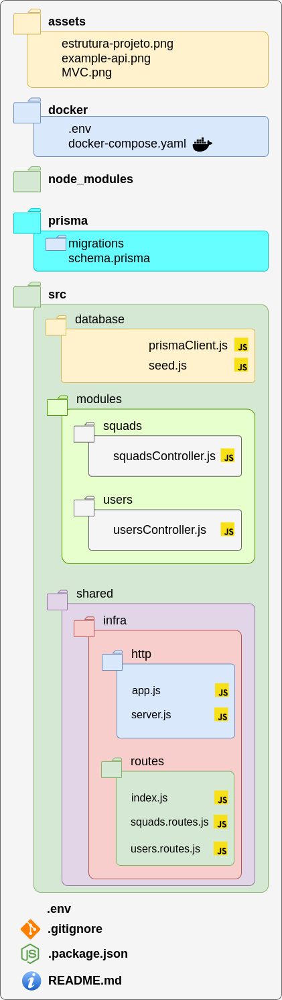
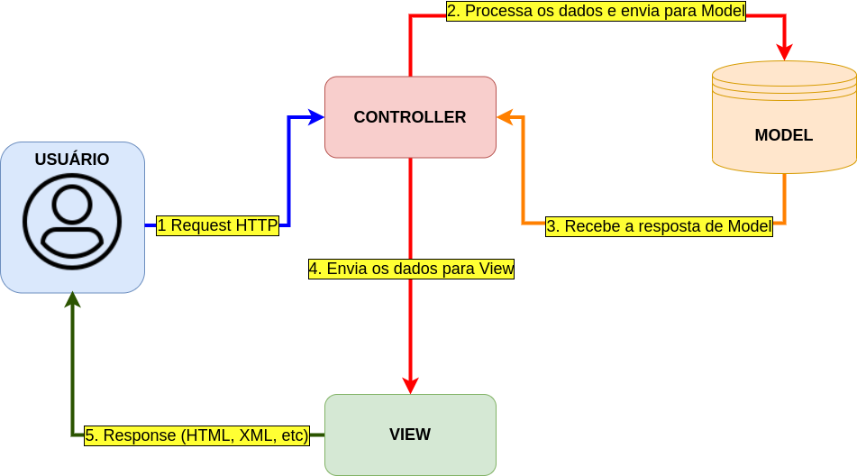

# Example API


## Índice
- [Objetivo](#objetivo)
- [Requisitos](#requisitos)
- [Estrutura do Projeto](#estrutura-do-projeto)
- [Ferramentas Utilizadas](#ferramentas-utilizadas)
- [Proposta](#proposta)
    - [Parte I](#parte-i)
    - [Parte II](#parte-ii)
    - [Parte III](#parte-iii)
- [Usando a Aplicação](#usando-a-aplicação)
- [Comandos Úteis](#comandos-úteis)
    - [Banco de Dados](#banco-de-dados)
    - [Docker](#docker)
    - [Prisma Studio](#prisma-studio)

## Objetivo
Proporcionar um ambiente simples, porém, objetivo para estudos quanto a conceitos básicos para o desenvolvimento de _software_:
- Regras de Negócio [**RN**];
- Requisitos do Usuário [**RU**];
- Requisitos de Sistema [**RS**];
- Requisitos Funcionais [**RF**];
- Requisitos Não Funcionais [**RNF**].

## Requisitos
- [Docker](https://www.docker.com/)
- [Node.js](https://nodejs.org/pt-br/) >= 16.15.1
- [nvm](https://github.com/nvm-sh/nvm)

## Estrutura do Projeto
<div align="center">
    
</div>

<div align="center">
⚠️<strong>ATENÇÃO</strong>⚠️<br>
<i>Não é recomendado subir os arquivos <code>.env</code>, neste caso trata-se apenas de um exercício.</i>
</div>

## Ferramentas Utilizadas
- **Container:** Docker;<br>
- **Database:** [PostgreSQL](https://www.postgresql.org/);<br>
- **ORM:** [Prisma](https://www.prisma.io/).<br>

## Proposta
Cenário fictício para análise:<br>

### Parte I
<details><summary>Clique para expandir</summary>
Com base nos pontos descritos, informe qual é o termo que se enquadra (RN, RU, RS, RF, RNF)

1. Usuário deve ser capaz de cadastrar uma Squad e um Usuário<br>
- [ ] RN
- [ ] RU
- [ ] RS
- [ ] RF
- [ ] RNF

2. O sistema deve listar todas as Squads e Usuários Cadastrados
- [ ] RN
- [ ] RU
- [ ] RS
- [ ] RF
- [ ] RNF

3. O banco de dados deve ser relacional
- [ ] RN
- [ ] RU
- [ ] RS
- [ ] RF
- [ ] RNF

4. Enquanto usuário quero poder consultar os membros de uma Squad pelo nome da mesma
- [ ] RN
- [ ] RU
- [ ] RS
- [ ] RF
- [ ] RNF

5. Não podem existir duas Squads com o mesmo nome
- [ ] RN
- [ ] RU
- [ ] RS
- [ ] RF
- [ ] RNF

6. O cadastro do usuário recebe o `id` da Squad que estiver vinculado
- [ ] RN
- [ ] RU
- [ ] RS
- [ ] RF
- [ ] RNF

7. Para atualizar o cadastro da Squad devo informar o nome da mesma
- [ ] RN
- [ ] RU
- [ ] RS
- [ ] RF
- [ ] RNF

8. Quero ter autonomia para atualizar o cadastro de uma Squad
- [ ] RN
- [ ] RU
- [ ] RS
- [ ] RF
- [ ] RNF

9. O banco de dados utilizados deve ser o PostgreSQL
- [ ] RN
- [ ] RU
- [ ] RS
- [ ] RF
- [ ] RNF

10. Só posso alterar o cadastro de uma Squad se não houverem membros vinculados a ela
- [ ] RN
- [ ] RU
- [ ] RS
- [ ] RF
- [ ] RNF

</details>

### Parte II
Agora que já possui uma base dos requisitos da aplicação, devemos realizar a modelagem do Banco de Dados.

1. No diretório [`prisma`](./prisma/), no arquivo [`schema.prisma`](./prisma/schema.prisma) realize a configuração das tabelas, campos e tipos de dados que julgar necessários para atender a proposta.

2. Considere diagramar o **MER** (Modelo Entidade Relacionamento) para enriquecer seu Projeto.

### Parte III
O Projeto já possui uma estrutura base, iremos utilizar o padrão **MVC** (_Model, View_ e _Controller_) neste exercício. Apesar de muitas pessoas considerarem essa sigla como um padrão de design de interface, na verdade ele é um padrão de arquitetura de software responsável por contribuir na otimização da velocidade entre as requisições feitas pelo comando dos usuários.<br>
Em resumo trata-se de:

<div align="center">
    
</div>

- **_Model_:** Essa classe também é conhecida como _Business Object Model_ (objeto modelo de negócio). Sua responsabilidade é gerenciar e controlar a forma como os dados se comportam por meio das funções, lógica e regras de negócios estabelecidas.

- **_View_:** Essa camada é responsável por apresentar as informações de forma visual ao usuário. Em seu desenvolvimento devem ser aplicados apenas recursos ligados a aparência como mensagens, botões ou telas.<br>
**IMPORTANTE:** Neste cenário de estudos não iremos nos aprofundar nesta camada, visto que o foco é exclusivamente o Back-end.

- **_Controller_:** A camada de controle é responsável por intermediar as requisições enviadas pelo _View_ com as respostas fornecidas pelo _Model_, processando os dados que o usuário informou e repassando para outras camadas. 

## Usando a Aplicação
1. Instale as dependêcias
```
yarn install
```

2. Suba o container do Banco de Dados
```
docker-compose -f docker/docker-compose.yaml --env-file docker/.env up -d
```

3. Rode o comando para instanciar o Prisma
```
yarn prisma generate
```

4. Rode o comando para gerar as migrations:
```
yarn migrate:run
```

5. Popule o Banco de Dados
```
yarn seed
```

6. Inicie a aplicação
```
yarn dev
```

## Comandos Úteis

### Banco de Dados
Comando para resetar a base de dados local
```
yarn migrate:reset
```

### Docker
Comando para subir o container do Banco de Dados
```
docker-compose -f docker/docker-compose.yaml --env-file docker/.env up -d
```

### Prisma Studio
Comando para renderizar um gerenciador de Banco de Dados em seu [browser](http://localhost:5555)
```
yarn studio
```